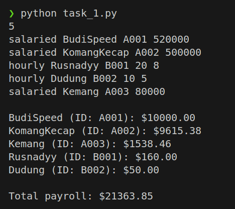
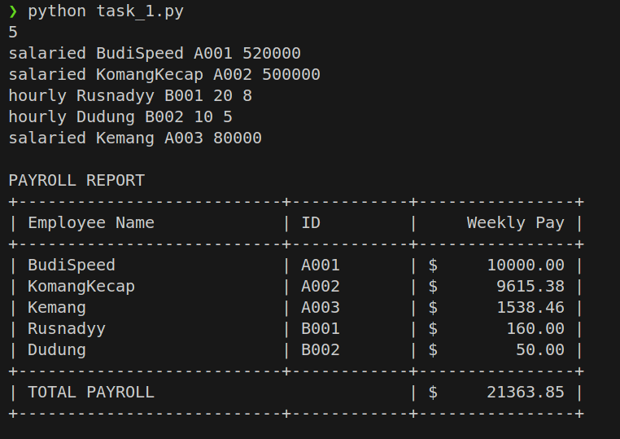
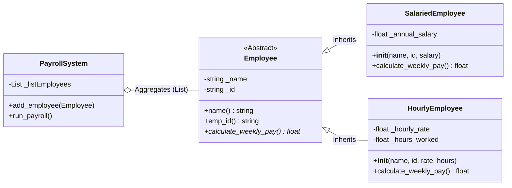
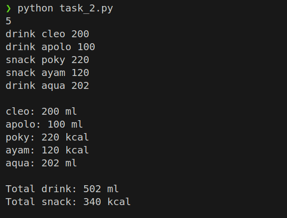
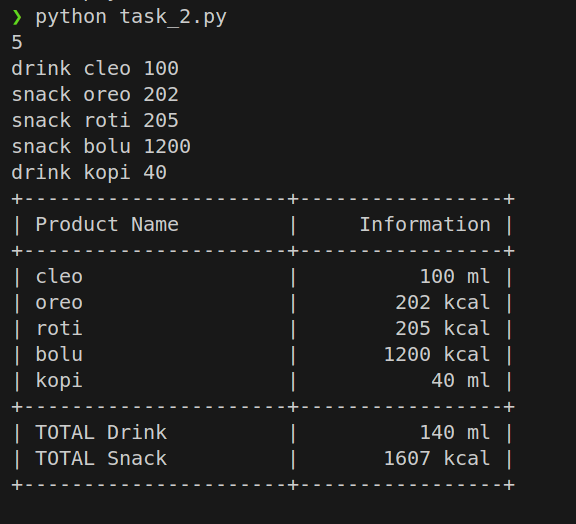
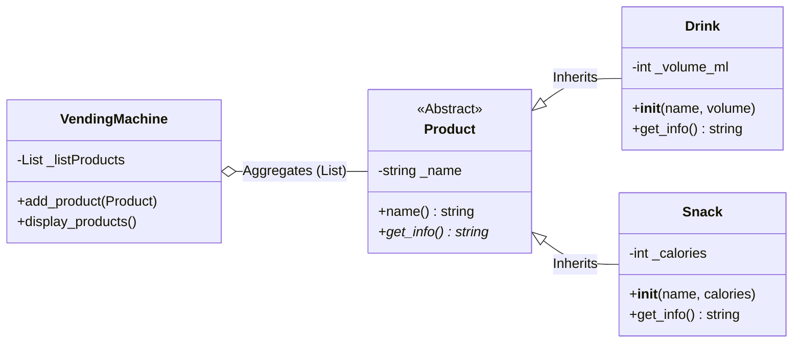

# BARUNASTRA STAGE2 Programming Division
## Vision Subdivision

# Task 1 (Payroll System)
## How It Works

* The program models employees using an `Employee` class that defines a common interface on the Abstract Base Class (ABC).
* Its two main functions include:

* `Salaried` = stores the annual salary. The weekly salary is calculated by dividing the annual salary by 52.
* `Hourly` = stores the hourly rate and the number of hours worked. The weekly salary is calculated by multiplying the hourly rate by the hours worked.

* The program reads a number of employee inputs, creates the appropriate objects (Salaried or Hourly), and stores them in a list.
* For each object, the program calls the same method `calculate_weekly_pay`, thus implementing polymorphism.
* The output is displayed as an ASCII table that summarizes each employee's key information, along with their weekly salary.

## Calculation Rules

* `Salaried.weekly_pay = annual_salary / 52`
* `Hourly.weekly_pay = rate_per_hour * hours_worked`

## Example Input (conceptual)

```
5
salaried BudiSpeed A001 520000
salaried KomangKecap A002 500000
hourly Rusnadyy B001 20 8
hourly Dudung B002 10 5
salaried Kemang A003 80000
```

## Output

<table width="100%">
  <tr>
    <td width="50%" align="center" valign="top">
      <h3> Normal Output Case </h3>
      
    </td>
    <td width="50%" align="center" valign="top">
      <h3> ASCII Table </h3>
      
    </td>
  </tr>
</table>

---

##

---

This diagram illustrates the object-oriented architecture of the Payroll System, primarily utilizing inheritance and polymorphism to ensure scalability. The system is built upon an abstract base class, Employee, which establishes a unified interface containing standard attributes and an abstract method for payment calculation. This structure enforces concrete subclasses, SalariedEmployee and HourlyEmployee, to implement distinct logic for annual versus hourly pay while inheriting common traits. Finally, the PayrollSystem class functions as a manager that aggregates these employee objects, leveraging dynamic binding to process weekly payments uniformly across different employment types.

---

# Task 2 (Vending Machine System)

## How It Works

* The program models products using the Abstract Base Class `Product`, which stores basic attributes such as name.
* Two primary derivatives:

* `Drink` — additional attribute `volume` (in ml).
* `Snack` — additional attribute `calories` (in kcal).
* The program reads the product list, ignores rows with unknown types (typo protection), and then saves a valid object.
* The program displays the list of listed products and calculates the aggregates:

* Total drink volume (ml)
* Total calories of all snacks (kcal)

## Example Input (conceptual)
```
5
drink cleo 200
drink apolo 100
snack poky 220
snack ayam 120
drink aqua 202
```

## Output

<table width="100%">
  <tr>
    <td width="50%" align="center" valign="top">
      <h3> Normal Output Case </h3>
      
    </td>
    <td width="50%" align="center" valign="top">
      <h3> ASCII Table</h3>
      
    </td>
  </tr>
</table>

---


---

This diagram illustrates a scalable Vending Machine architecture built upon Inheritance and Polymorphism. The system defines an abstract Product base class to establish a common interface, which is extended by concrete Drink and Snack subclasses to handle specific attributes volume (ml) and calories (kcal) independently. The VendingMachine class functions as a central manager, utilizing Aggregation to store a mixed list of products and dynamically retrieving their specific details via the polymorphic get_info() method, ensuring the system remains flexible for future extensions.

---

# Explanation of OOP Concepts

* **Encapsulation** is shown through object attributes accessed via properties/methods, ensuring the output format remains consistent.
* **Inheritance** allows `Salaried`/`Hourly` and `Drink`/`Snack` to share fundamental behaviors from their parent classes.
* **Polymorphism** enables the same functions (`calculate_weekly_pay`, `get_info`) to be called on different objects without explicitly checking their types.
* **Abstraction** enforces a minimal interface that must be implemented by all derived classes.
